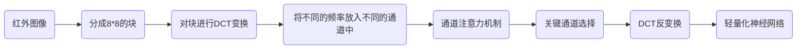
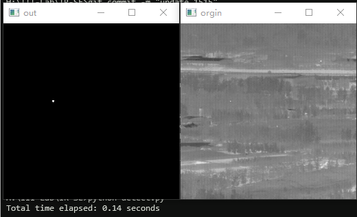

# 红外图像 -> 轻量化网络

## Introduce

```mermaid

flowchart LR
    A(红外图像)
    B(分成8*8的块)
    C(对块进行DCT变换)
    D(将不同的频率放入不同的通道中)
    E(通道注意力机制)
    F(关键通道选择)
    G(DCT反变换)
    H(轻量化神经网络)
    
    A-->B-->C-->D
    D-->E-->F-->G-->H

```

## Result

## Refer

- [squeeze_and_excitation](https://github.com/ai-med/squeeze_and_excitation)
